# 🏛️ My Arch Linux Configuration

A comprehensive and beautiful Arch Linux desktop configuration featuring **BSPWM** window manager with multiple aesthetic themes, complete dotfiles, and a modern workflow setup.

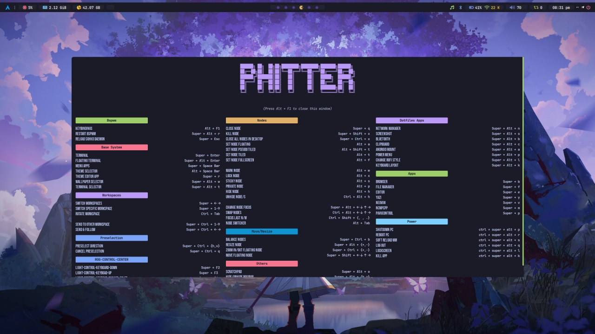

## 🌟 Features

### 🪟 Window Manager & Desktop
- **BSPWM** (Binary Space Partitioning Window Manager) - Tiling window manager
- **Multiple Rice Themes** - 18+ beautiful pre-configured themes
- **Dynamic Theme Switching** - Switch themes on-the-fly with RiceSelector
- **Multi-monitor Support** - DPI-aware scaling and configuration
- **Polybar/EWW** - Beautiful status bars with widgets

### 🎨 Available Themes (Rices)
| Theme | Colorscheme | Preview |
|-------|-------------|---------|
| **Aline** | Rose Pine Dawn | 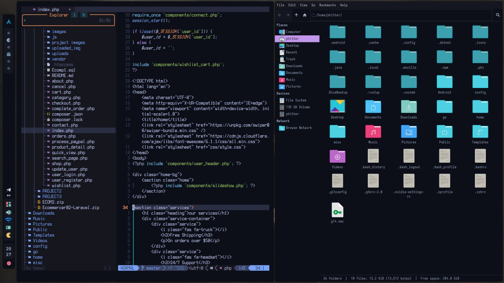 |
| **Andrea** | Custom Purple | 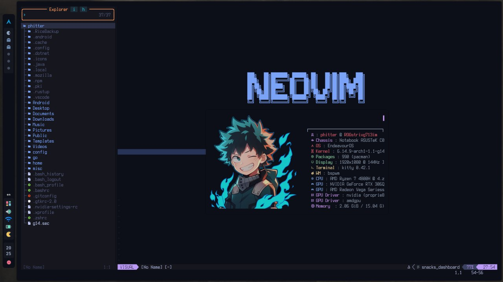 |
| **Brenda** | Forest Green | 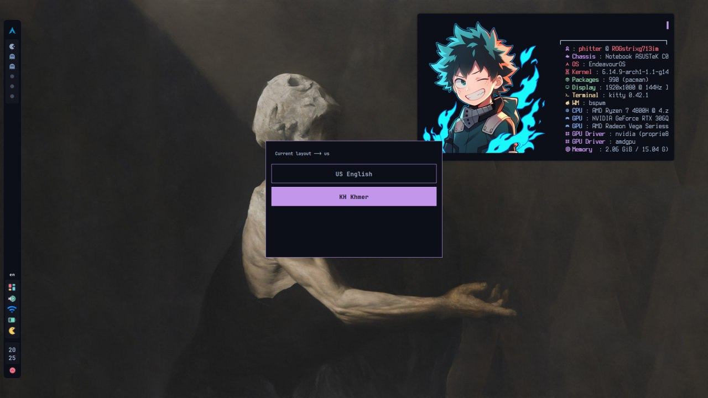 |
| **Cristina** | Rose Pine Moon | 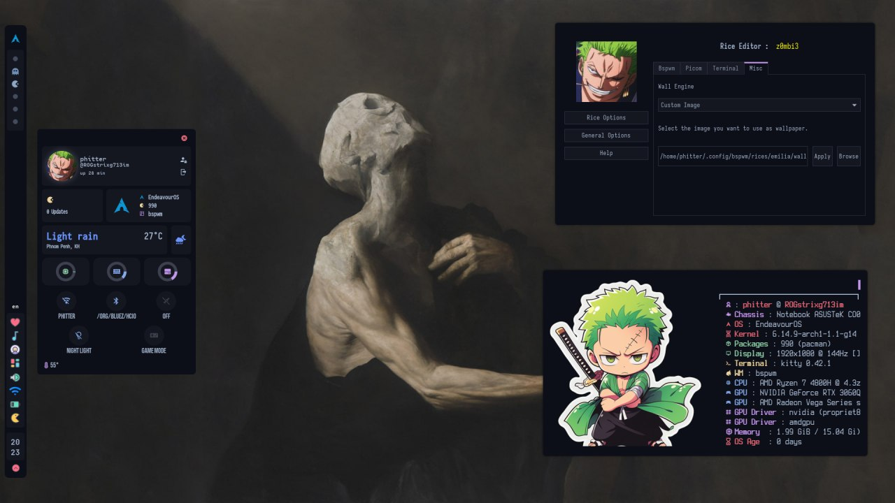 |
| **Cynthia** | Dark Purple | 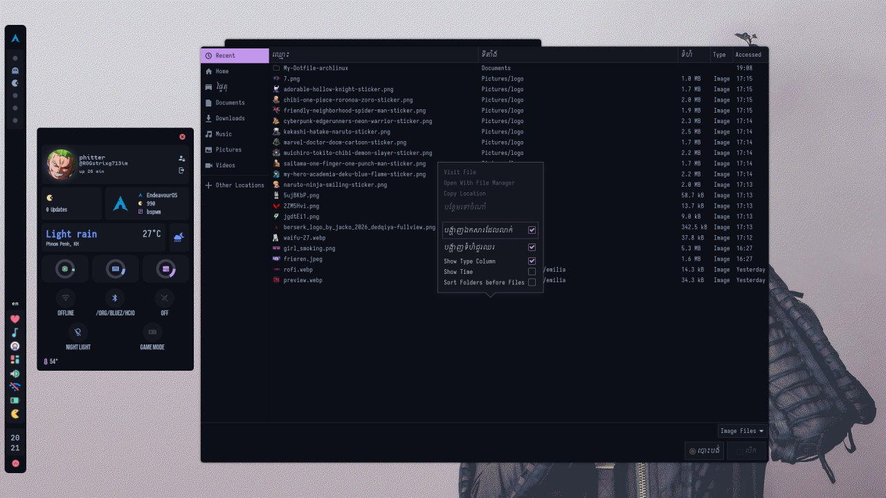 |
| **Daniela** | Catppuccin Mocha | 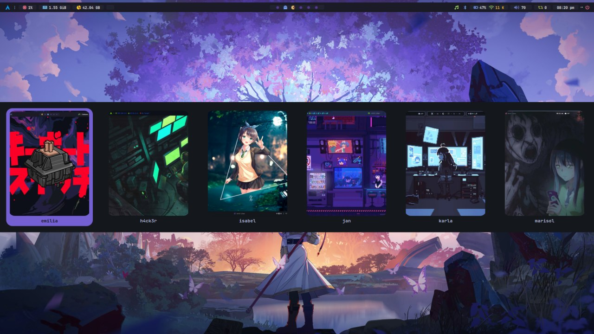 |
| **Emilia** | Tokyo Night | 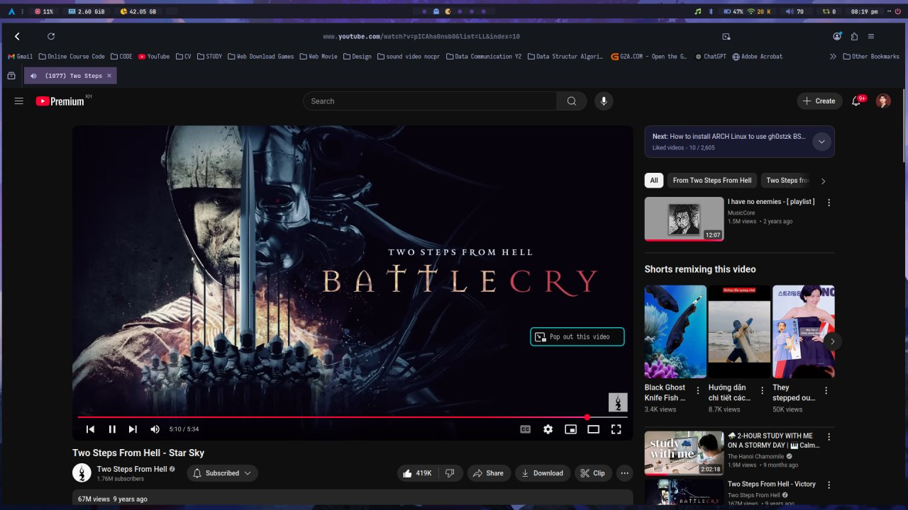 |
| **H4ck3r** | Hack The Box | 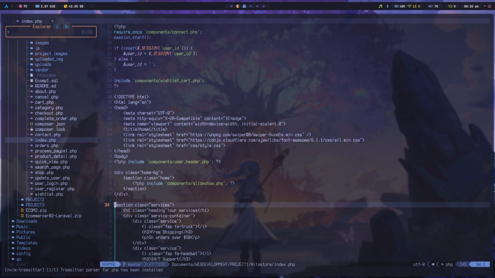 |
| **Isabel** | OneDark | 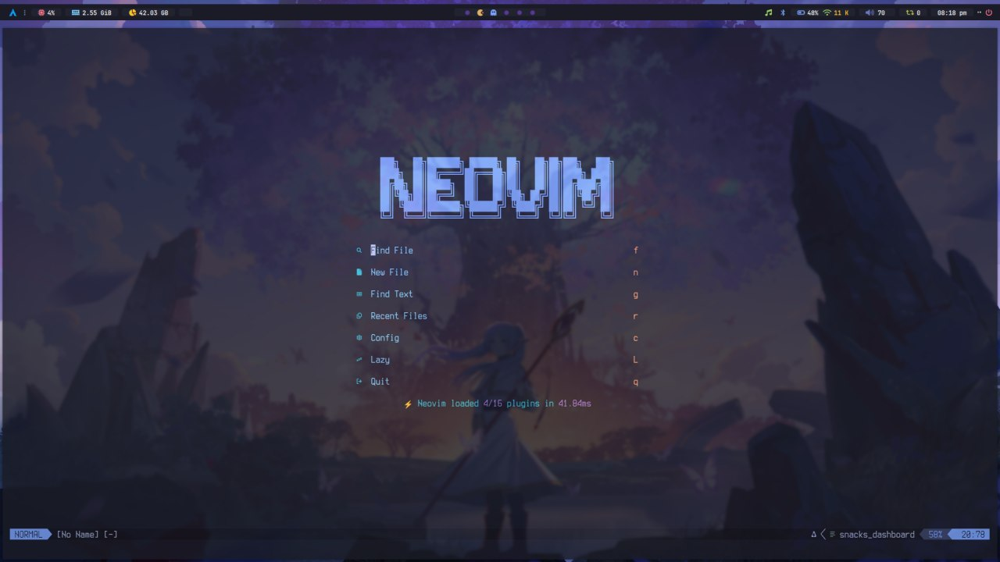 |
| **Jan** | CyberPunk | 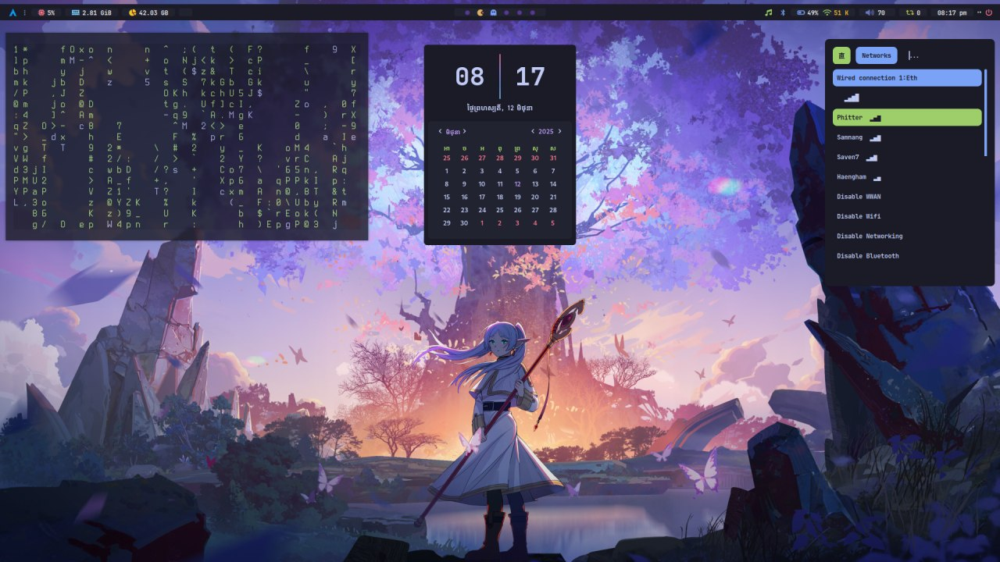 |
| **Karla** | Minimalist | 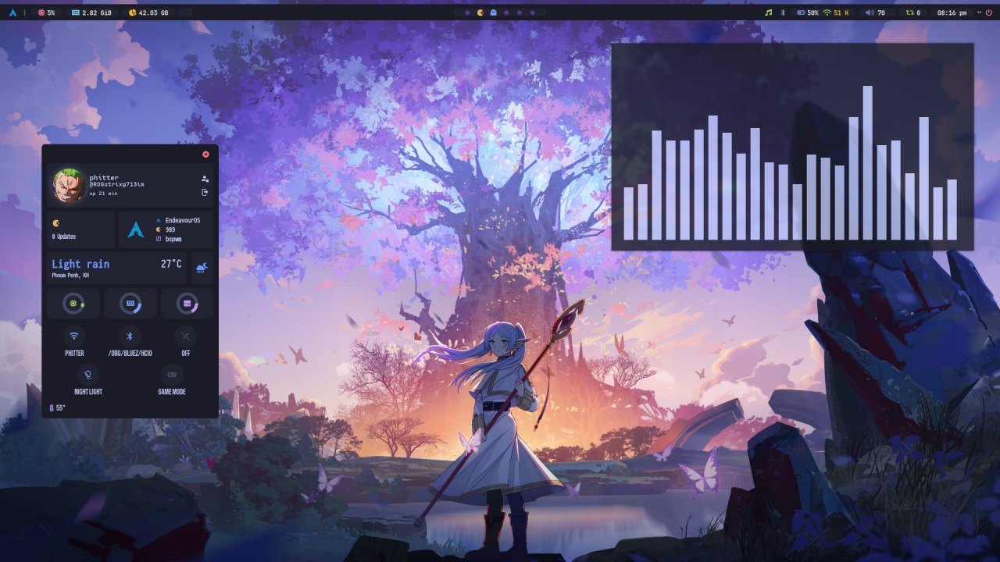 |
| **Marisol** | Dracula | 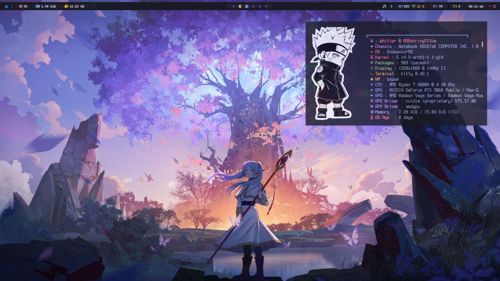 |
| **Melissa** | Nord | 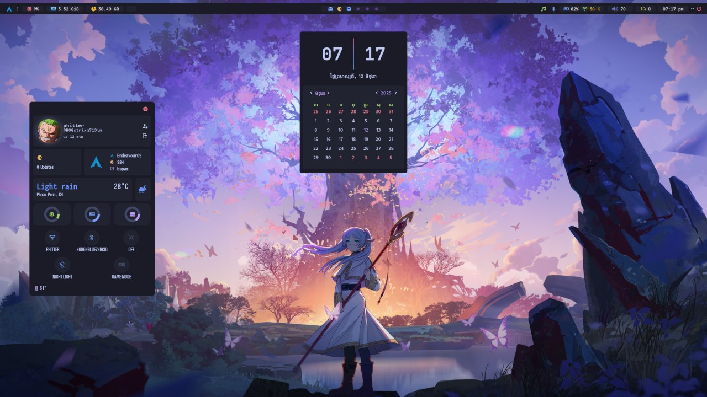 |

### 🛠️ Applications & Tools
- **Terminal Emulators**: Alacritty, Kitty
- **Text Editors**: Neovim (configured), Geany
- **File Managers**: Yazi (terminal-based), Thunar
- **Music**: MPD + ncmpcpp
- **Clipboard**: Clipcat
- **System Info**: Fastfetch
- **Terminal Multiplexer**: Tmux
- **Application Launcher**: Rofi
- **Notifications**: Dunst
- **Compositor**: Picom

### ⚙️ Key Components

#### 🎛️ Rice Editor
A custom GTK3 Python application for real-time theme customization:
- Border colors and width configuration
- Picom effects (shadows, corners, blur, animations)
- Terminal transparency settings
- Font configuration
- Wallpaper engine options

#### 🔄 Theme System
- **RiceSelector**: Dynamic theme switcher with preview
- **Theme.sh**: Automated theme application script
- **Per-theme configurations**: Each rice has its own complete config set
- **Instant switching**: No logout required

## 🚀 Installation

### Prerequisites
```bash
# Essential packages
sudo pacman -S bspwm sxhkd rofi polybar picom alacritty kitty
sudo pacman -S dunst mpd ncmpcpp fastfetch git

# Optional but recommended
sudo pacman -S thunar firefox neovim tmux
```

### Setup
1. **Clone the repository**:
   ```bash
   git clone https://github.com/buoysophit/My-Archlinux-Config.git
   cd My-Archlinux-Config
   ```

2. **Backup existing configs** (if any):
   ```bash
   mkdir -p ~/.config/backup
   cp -r ~/.config/bspwm ~/.config/backup/ 2>/dev/null || true
   ```

3. **Install configurations**:
   ```bash
   cp -r config/* ~/.config/
   ```

4. **Make scripts executable**:
   ```bash
   chmod +x ~/.config/bspwm/src/*
   chmod +x ~/.config/bspwm/bspwmrc
   ```

5. **Set default theme**:
   ```bash
   echo "emilia" > ~/.config/bspwm/.rice
   ```

## 🎯 Usage

### Theme Switching
- **Quick Selector**: `Super + Alt + s` or run `RiceSelector`
- **Rice Editor**: `Super + Alt + e` for real-time customization
- **Manual**: Edit `~/.config/bspwm/.rice` file

### Key Bindings (Default)
- `Super + Return` - Open terminal
- `Super + d` - Application launcher (Rofi)
- `Super + Alt + s` - Theme selector
- `Super + Alt + e` - Rice editor
- `Super + Alt + w` - Wallpaper selector
- `Super + Shift + q` - Close window
- `Super + {h,j,k,l}` - Navigate windows

### Widgets & Bars
Each theme includes configured widgets for:
- System stats (CPU, RAM, temperatures)
- Music player controls
- Network status
- Calendar and weather
- Notifications
- System controls

## 📁 Project Structure
```
config/
├── alacritty/          # Alacritty terminal config + themes
├── bspwm/              # Main BSPWM configuration
│   ├── rices/          # Individual theme configurations
│   ├── src/            # Scripts and utilities
│   └── eww/            # EWW widgets (alternative to Polybar)
├── clipcat/            # Clipboard manager
├── fastfetch/          # System info tool
├── geany/              # Text editor themes
├── kitty/              # Kitty terminal themes
├── mpd/                # Music player daemon
├── ncmpcpp/            # Music player client
├── nvim/               # Neovim configuration
├── tmux/               # Terminal multiplexer
└── yazi/               # File manager configuration
```

## 🎨 Customization

### Creating New Themes
1. Copy an existing theme directory in `rices/`
2. Modify `theme-config.bash` with your colors
3. Update wallpapers and assets
4. Test with RiceSelector

### Color Schemes
Each theme uses a complete color palette:
- Background/Foreground colors
- ANSI color set (black, red, green, yellow, blue, magenta, cyan, white)
- Bright variants
- Accent colors for UI elements

## 🤝 Contributing

Feel free to:
- Report bugs or issues
- Suggest new features
- Submit new themes
- Improve documentation
- Share screenshots

## 📜 License

This configuration is inspired by and based on the work of [gh0stzk](https://github.com/gh0stzk/dotfiles).

## 🔗 Links

- **Original Inspiration**: [gh0stzk's dotfiles](https://github.com/gh0stzk/dotfiles)
- **BSPWM**: [Binary Space Partitioning Window Manager](https://github.com/baskerville/bspwm)
- **Arch Linux**: [Official Documentation](https://wiki.archlinux.org/)

---

<div align="center">

**⭐ Star this repository if you found it useful!**

Made with ❤️ for the Arch Linux community

</div>
